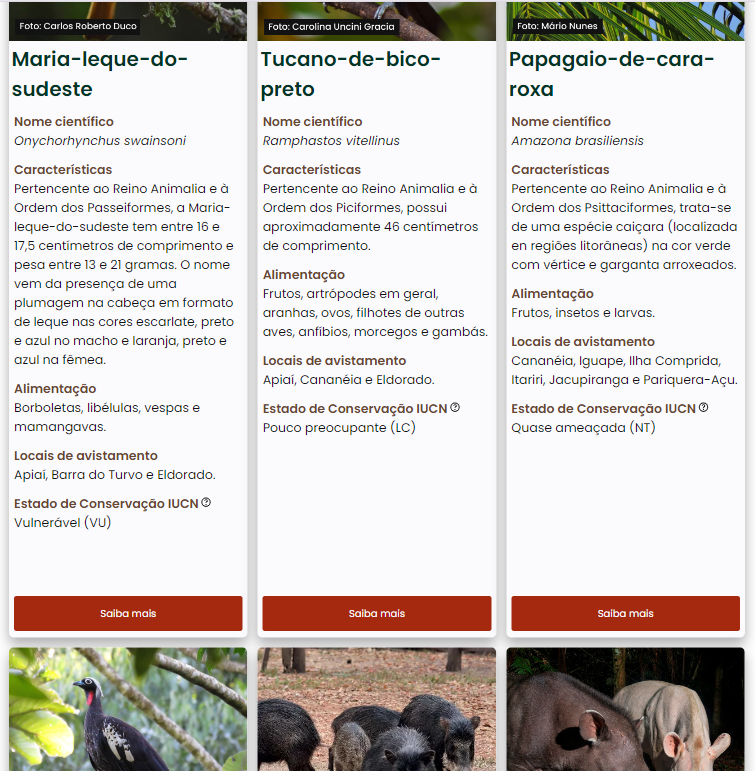
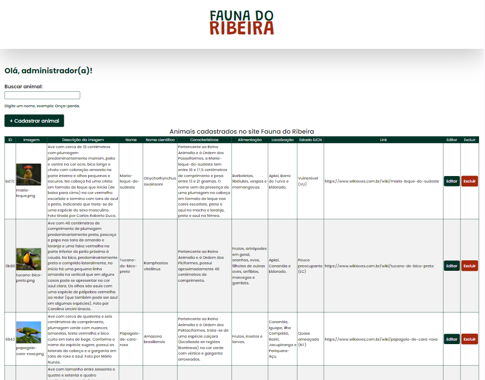
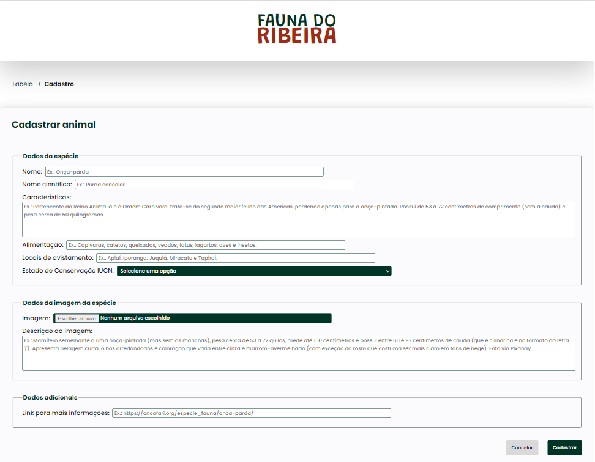
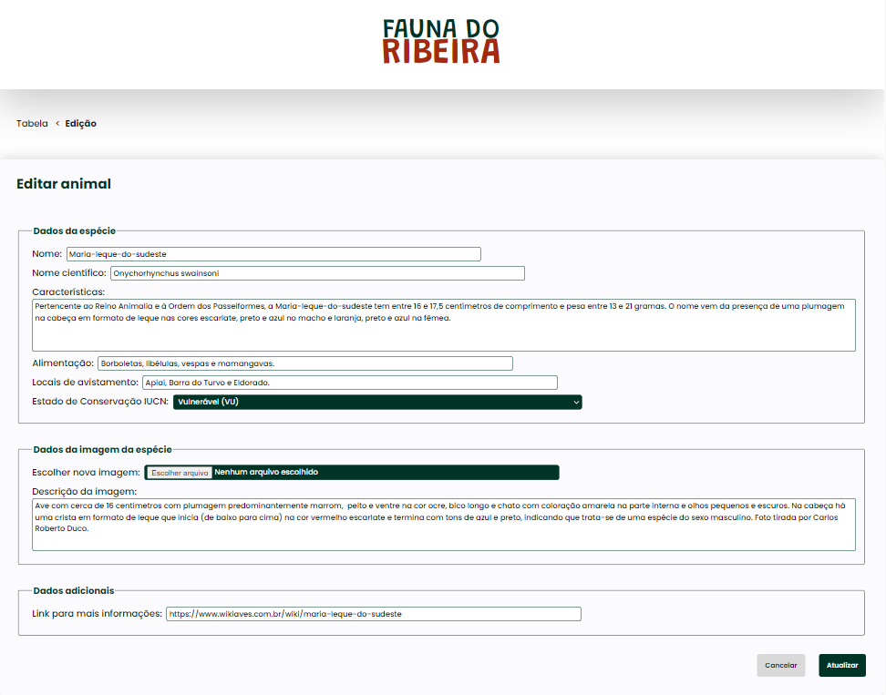
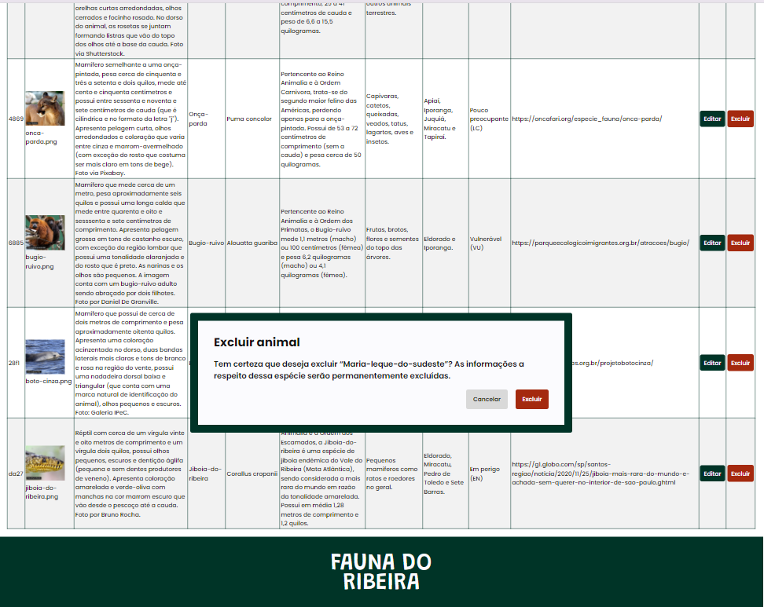
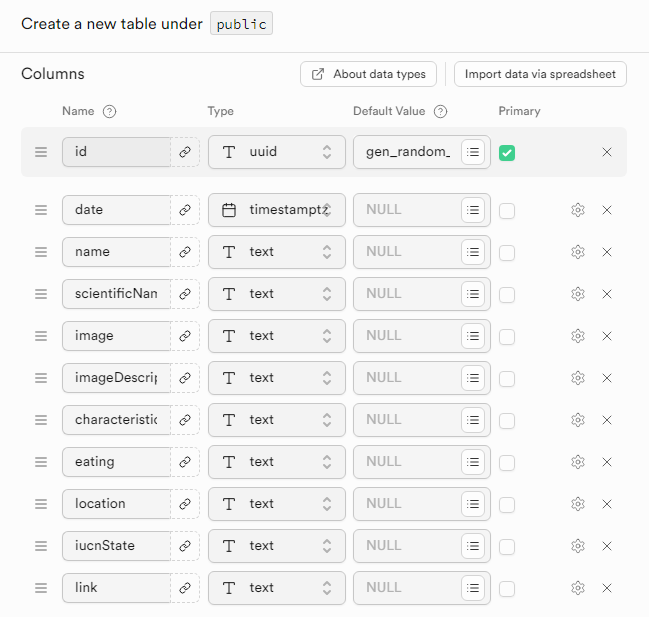
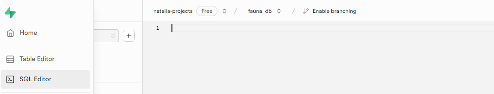
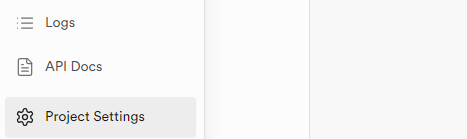
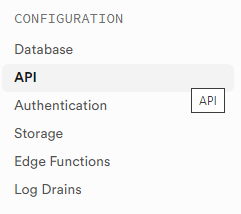
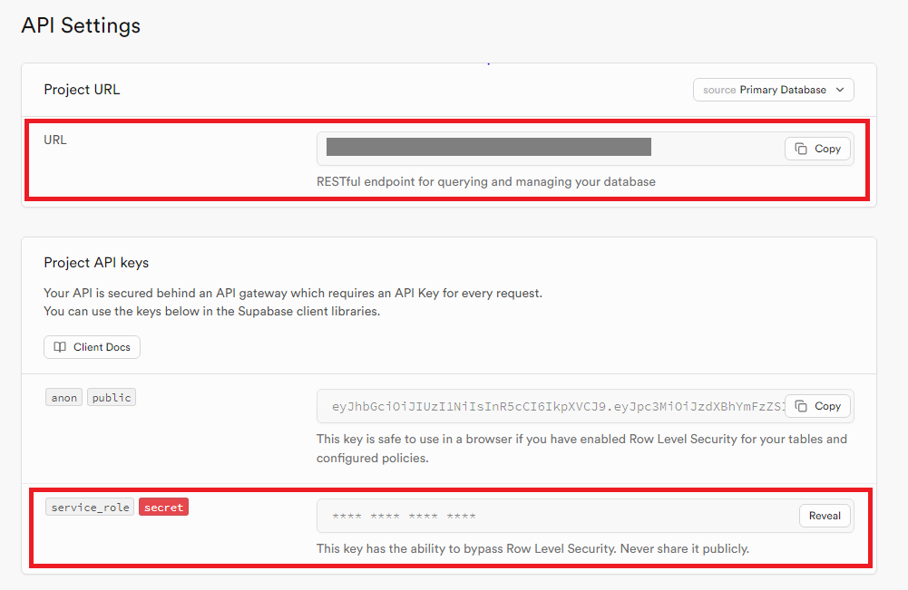

# Projeto Fauna do Ribeira: operações CRUD com espécies pertencentes à fauna da região do Vale do Ribeira
## Trabalho de Conclusão de Curso da Pontifícia Universidade Católica do Rio Grande do Sul (PUCRS)
### Pós-graduação em Desenvolvimento Full Stack

Website que exibe alguns dos animais pertences à fauna nativa da região do Vale do Ribeira no Estado de São Paulo. São apresentadas as seguintes informações a respeito de cada espécie: nome científico, características, alimentação, locais de avistamento, estado de conservação segundo a União Internacional para a Conservação da Natureza e dos Recursos Naturais (IUCN) e link para mais informações. 🦜

## Índice
- <a href="#funcionalidades-do-projeto">Funcionalidades do projeto</a>
- <a href="#tecnologias-utilizadas">Tecnologias utilizadas</a>
- <a href="#layout">Layout</a>
- <a href="#demonstração">Demonstração</a>
- <a href="#como-rodar-o-projeto-na-sua-máquina">Como rodar o projeto na sua máquina</a>
- <a href="#pessoas-autoras">Pessoas autoras</a>
- <a href="#próximos-passos">Próximos passos</a>

## Funcionalidades do projeto
- [x] Cadastro das espécies de animais
- [x] Campo de busca das espécies cadastradas
- [x] Edição das espécies 
- [x] Exclusão das espécies
- [x] Exibição das espécies no formato de cards

## Tecnologias utilizadas
- Linguagens de programação

    
    

- Framework, biblioteca e ferramenta

    
     
    

- Linguagem de estilo

    

- Banco de Dados

    

- Testes E2E

    
    
- CI/CD

    

- Deploy/Hospedagem

    

## Layout 
### 🙋 Usuário 



### 👩‍🔧 Administrador





## Demonstração
[Link da página principal](https://fauna-do-ribeira.vercel.app/) 

[Link da página de gerenciamento](https://fauna-do-ribeira.vercel.app/admin)

## Como rodar o projeto na sua máquina
- Primeira etapa: download do projeto
    - No seu terminal, digite o seguinte comando:
        ```bash
        gh repo clone natfmacedo/fauna-do-ribeira
        ```
- Segunda etapa: criação do Banco de Dados
    - Acesse [ o site do Supabase](https://supabase.io/)
    - Crie uma conta (de preferência vinculada ao seu GitHub)
    - Clique em `Create organization`/`Criar organização` após preencher os campos solicitados
    - Clique em `Create new project`/`Criar novo projeto` após definir o nome, a senha e a região do seu BD
    - Clique em `Table editor`/`Editor de tabela`
    - Crie uma tabela chamada `animal` com as colunas `id`, `date`, `name`, `scientificName`, `image`, `imageDescription`, `characteristics`, `eating`, `location`, `iucnState` e `link` com as confirgurações conforme a imagem abaixo:
    
    - Vá em `SQL editor`/`Editor SQL`:
    
    - Cole o arquivo `animal_rows.sql` disponível na pasta `core` do projeto
    - Clique em `run`/`rodar` para preencher a tabela com os dados do projeto

- Terceira etapa: definição das variáveis de ambiente
  - Ainda no Supabase, vá em `Project Settings`/`Configurações do Projeto`:
  
  - Clique em `API`:

      
  - Copie a `URL` e a chave `secret`:
  
  - Crie um arquivo chamado `.env` na raiz do projeto e defina as variáveis de ambiente da seguinte forma:
    ```bash
    SUPABASE_URL= #cole aqui a URL do projeto
    SUPABASE_SECRET_KEY= #cole aqui a chave secreta do projeto
    ```
- Quarta e última etapa: execução do projeto
    - No terminal, digite os seguintes comandos para instalar as dependências necessárias, rodar o projeto e os testes do projeto, respectivamente:
        ```bash
        npm install
        npm run dev
        npm run test
        ```
## Pessoas autoras
### Natália Félix Macedo
 

[](https://www.linkedin.com/in/nataliafelixm/)
[](mailto:nfelixmacedo@gmail.com)

## Próximos passos

- [ ] Implementação do algoritmo de paginação
- [ ] Aprimoramento do algoritmo de upload das imagens
- [ ] Aprimoramento do Banco de Dados
